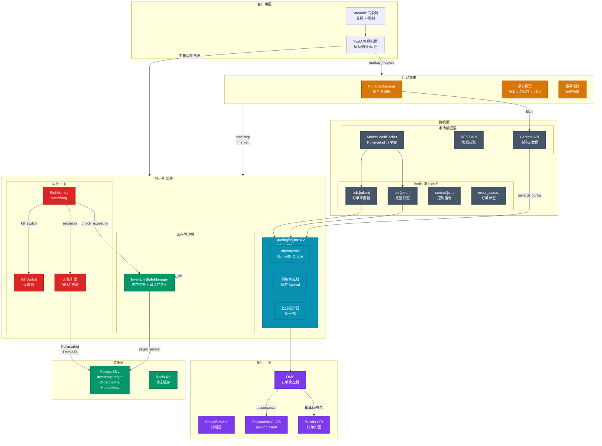

# 系统整体架构图

## 架构说明

### 三层分离设计

| 层次 | 职责 | 关键技术 |
|------|------|----------|
| **数据面** | WebSocket 订阅、REST 快照、消息分发 | `redis.asyncio` Pub/Sub |
| **核心引擎层** | 定价、报价、风控、库存 | asyncio 热路径零 DB |
| **执行平面** | OMS 状态机、CLOB 交互、签名 | py-clob-client |

### 关键设计原则

1. **内存优先**: 热路径完全无 DB 读取
2. **消息解耦**: 所有模块通过 Redis Pub/Sub 通信
3. **状态分离**: 控制面(FastAPI) 与 数据面(Engine) 解耦
4. **异步持久化**: 成交 → 内存更新 → 异步队列 → DB

---

*设计亮点: 准机构级架构，热点路径完全内存化，零 DB 阻塞*
