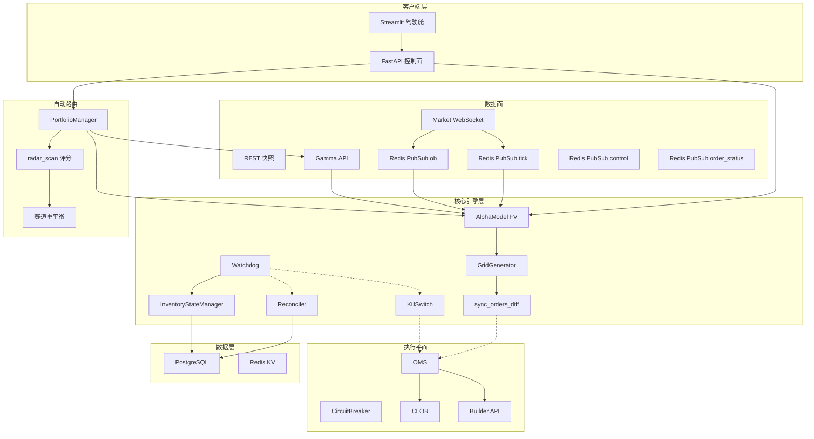

# 系统整体架构图

以下为 **兼容性优先** 的 Mermaid：无 `%%{init}`、无嵌套 subgraph、无 `class`/`style`、无边标签、无 ` `，避免 Cursor / VS Code / GitHub 内置解析器报错。原「彩色分层 + 嵌套分组」若需导出 PPT，可用 [mermaid.live](https://mermaid.live) 在可渲染版本上再加样式。

## 架构说明

### 此前常见渲染失败原因（已在本图规避）

1. **`style QuotingEngine`**：`QuotingEngine` 是 **subgraph**，不是节点；对 subgraph 做 `style` 在多数版本会直接语法错误。  
2. **子图套子图**：三层嵌套在部分预览引擎上不稳定。  
3. **`%%{init: ...}`**：`themeVariables` 大括号或引号稍有不匹配，整段图失败。  
4. **`classDef` 里的 `stroke-width`**：少数解析器对带连字符的样式串不兼容。  
5. **边标签**里的 `/`、`()`、` `：个别渲染器会误解析。

### 三层分离设计

| 层次 | 职责 | 关键技术 |
|------|------|----------|
| **数据面** | WebSocket 订阅、REST 快照、消息分发 | `redis.asyncio` Pub/Sub |
| **核心引擎层** | 定价、报价、风控、库存 | asyncio 热路径零 DB |
| **执行平面** | OMS 状态机、CLOB 交互、签名 | py-clob-client |

### 关键设计原则

1. **内存优先**: 热路径完全无 DB 读取
2. **消息解耦**: 所有模块通过 Redis Pub/Sub 通信
3. **状态分离**: 控制面(FastAPI) 与 数据面(Engine) 解耦
4. **异步持久化**: 成交 → 内存更新 → 异步队列 → DB

> **图注**：`apply_fill()` 由 User WebSocket 成交路径调用 `InventoryStateManager`，并非 InvState 自指；故图中不单独画「自环」边。

---

*设计亮点: 准机构级架构，热点路径完全内存化，零 DB 阻塞*
