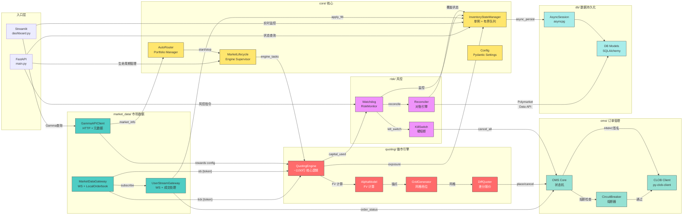

# 核心模块关系图



## 模块依赖矩阵

```
                    Gateway  UserStream  Gamma  InvState  Engine  OMS  Watchdog  AutoRouter
MarketDataGateway     -        ↑          -       -         ↑      -       -          -
UserStreamGateway     -        -          -       ↑         -      ↑      -          -
GammaAPIClient        -        -          -       -         ↑      -       -          ↑
InventoryState        ↑        -          -       -         ↑      -       ↑          -
QuotingEngine         -        -          ↑       ↑         -      ↑      ↑          -
OMS                   -        -          -       -         -      -       -          -
Watchdog              -        -          -       ↑         -      ↑      -          -
AutoRouter            -        -          ↑       -         ↑      -       -          -
```

> **↑** = 依赖方向

## 关键接口契约

| 接口 | 路径 | 用途 |
|------|------|------|
| `tick:{token}` | Redis PubSub | 订单簿增量更新触发 |
| `ob:{token}` | Redis PubSub | 完整快照推送 |
| `apply_fill()` | 内存方法 | 成交后内存更新 |
| `check_exposure()` | Watchdog | 每秒风控检查 |
| `sync_orders_diff()` | Engine | 差分报价同步 |
