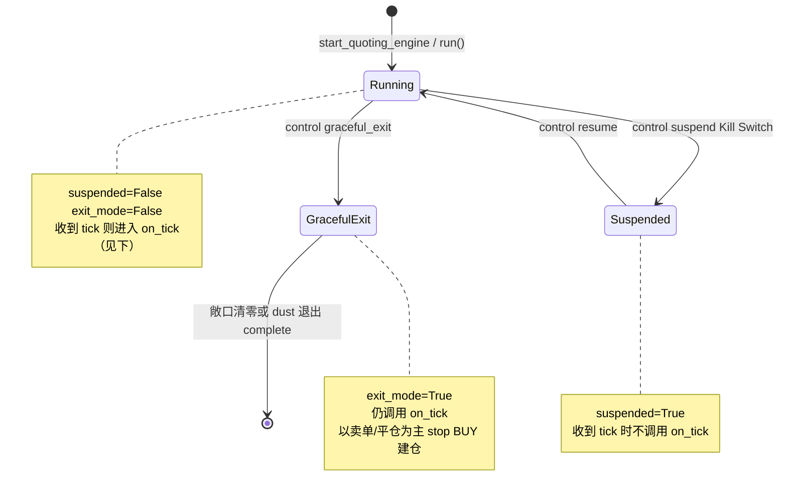

# QuotingEngine 运行语义（与代码一致）

`QuotingEngine` **没有**独立的有限状态机类；行为由 **`suspended` / `exit_mode`** 等**跨 tick 标志**，以及 **`on_tick` 内部的布尔与局部变量**（例如硬重置失败后的 `freeze_buys_post_reset_reconcile_fail`，**仅影响当前这一次 tick**）共同决定。

---

## 1. 跨 tick 标志（`listen` 循环 + 控制消息）

| 标志 | 设置方式 | 代码效果 |
|------|----------|----------|
| `suspended` | `control:{cid}` → `suspend` / `resume` | `suspend` 时 `cancel_all_orders`，此后 **跳过** `on_tick` |
| `exit_mode` | `graceful_exit` | 进入后 **仍跑** `on_tick`，逻辑上停止新 BUY 建仓并逐步平仓；结束后 `_shutdown_requested` |

---

## 2. 单次 `on_tick` 内：硬重置与「冻结 BUY」

- **周期**：约每 `300s`（`time.time() - last_grid_reset_time > 300`）且非 `exit_mode`。
- **互斥**：`_hard_reset_condition_lock` + `_hard_reset_peer_gate`，避免 YES/NO 双引擎与 CLOB `cancel_all` 竞态。
- **流程**：`oms.physical_clob_cancel_all_for_hard_reset()` → `cancel_all_orders(force_evict=True)` → `watchdog.reconcile_single_market(..., force=True)`。
- **`freeze_buys_post_reset_reconcile_fail`**：若本轮 **强制对账失败**，**仅本 tick** 在构建订单时 **跳过 BUY 网格**；**下一 tick 重新计算**，不是持久状态。

---

## 3. 引擎模式标签（Redis / 监控展示 `_publish_engine_mode`）

以下为 **当次 tick 计算出的展示用 mode**，不是 `stateDiagram` 状态：

| mode 字符串 | 代码侧主要条件 |
|-------------|----------------|
| `SUSPENDED` | 已处理 `suspend` 控制消息 |
| `GRACEFUL_EXIT` | `exit_mode` |
| `POST_RESET_RECONCILE_FREEZE` | 本 tick `freeze_buys_post_reset_reconcile_fail`（硬重置后对账失败） |
| `EXTREME_LIQUIDATING` | `is_extreme_long`（本侧 capital 接近上限） |
| `LOCKED_BY_OPPOSITE` | `cross_token_locked` |
| `TWO_WAY_QUOTING` / `QUOTING_BIDS_ONLY` | 正常报价，敞口是否达 dust 阈值等 |

---

## 4. 与旧版「状态机图」的差异说明

- **不存在**从 `GRACEFUL_EXIT` 转入 `POST_RESET_RECONCILE_FREEZE` 这类持久迁移；后者是 **tick 局部变量**。
- **不存在**「每分钟重试对账」的专用状态机；对账由 **Watchdog 周期** + **硬重置后单次 `reconcile_single_market`** 等路径触发。

---

*与实现文件对齐：`app/quoting/engine.py`（`on_tick`、`on_control_message`、`cancel_all_orders`）。*
