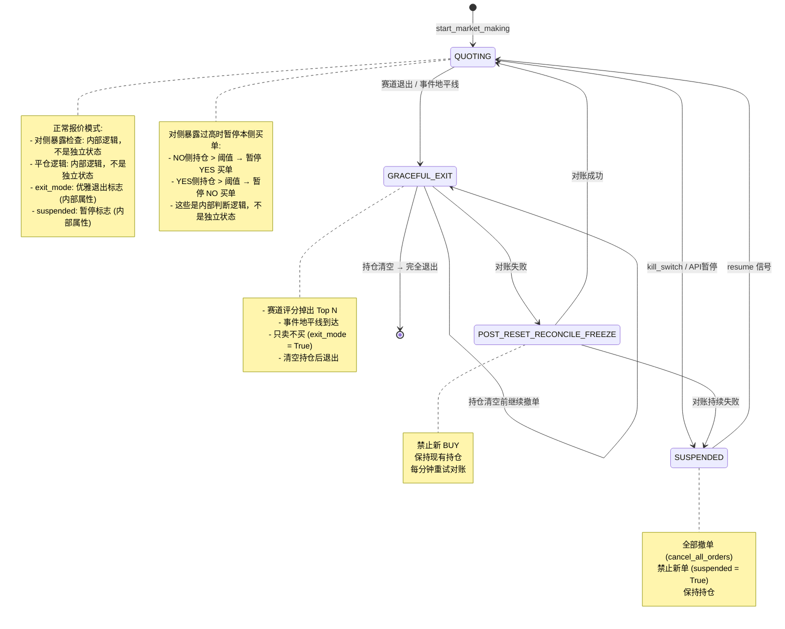

# QuotingEngine 状态机



## 状态转换矩阵

| 当前状态 | 触发条件 | 目标状态 | 动作 |
|----------|----------|----------|------|
| QUOTING | `kill_switch triggered` | SUSPENDED | 全部撤单 (cancel_all_orders) |
| QUOTING | `event_horizon reached` | GRACEFUL_EXIT | 设置 exit_mode = True |
| QUOTING | `graceful_exit signal` | GRACEFUL_EXIT | 设置 exit_mode = True |
| GRACEFUL_EXIT | `持仓清空` | [*] | 清理资源，完全退出 |
| GRACEFUL_EXIT | `reconcile failed` | POST_RESET_RECONCILE_FREEZE | 冻结 BUY |
| SUSPENDED | `resume signal` | QUOTING | 设置 suspended = False |
| POST_RESET_RECONCILE_FREEZE | `reconcile success` | QUOTING | 恢复报价 |
| POST_RESET_RECONCILE_FREEZE | `对账持续失败` | SUSPENDED | 保持冻结 |

> **注意**: 对侧暴露暂停买单 (LOCKED_BY_OPPOSITE) 和平仓 (LIQUIDATING/EXTREME_LIQUIDATING) 是 QuotingEngine 内部的判断逻辑，不是独立状态。实际代码中通过检查 exposure 来决定是否暂停买单。

## 状态详细说明

### 1. QUOTING (正常报价)
```python
# 正常双向报价模式
# - YES 侧: SELL at FV+spread, BUY at FV-spread
# - NO 侧: 派生自 YES 锚点
# - 动态 spread: base_spread * (1 + |OBI|)
# - 对侧暴露检查: 内部逻辑 (不切换状态)
# - 平仓检查: 内部逻辑 (不切换状态)
```

### 2. GRACEFUL_EXIT (优雅退出)
```python
# 满足以下条件时触发:
# - 赛道评分掉出 Top N
# - 事件地平线到达 (结算前 24h)
# - 设置 exit_mode = True，只卖不买，逐步清仓
# - 持仓清空后 → 完全退出
```

### 3. SUSPENDED (暂停)
```python
# kill_switch 或 API 暂停 (control signal)
# - 设置 suspended = True
# - 调用 cancel_all_orders() 全部撤单
# - 禁止新单
# - 保持持仓
# - 收到 resume 信号 → 恢复报价
```

### 4. POST_RESET_RECONCILE_FREEZE (对账失败冻结)
```python
# 硬重置后对账失败
# - 禁止新 BUY
# - 保持现有持仓
# - 每分钟重试对账
# - 对账成功 → 恢复正常 QUOTING
# - 对账持续失败 → 保持 SUSPENDED
```

### 内部逻辑 (非状态)

```python
# 对侧锁止 (LOCKED_BY_OPPOSITE) - 内部判断逻辑，非状态
if opposite_exposure > LOCK_THRESHOLD:
    skip_buy_orders()  # 暂停本侧买单，不切换状态

# 平仓逻辑 (LIQUIDATING) - 内部判断逻辑，非状态
if local_exposure > liquidate_threshold:
    only_sell = True  # 只开启卖单，不切换状态
```

---

*设计亮点: 简化的状态机，对侧暴露/平仓作为内部逻辑处理，状态转换清晰可控*
