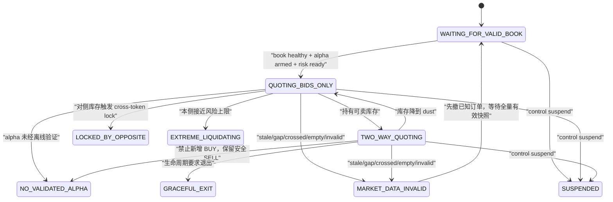

# QuotingEngine 当前运行语义

`QuotingEngine` 没有独立的有限状态机类。跨 tick 状态只有 `suspended`、`exit_mode` 和已提交库存快照；其余模式由每次合法行情 tick 重新计算。

```mermaid
stateDiagram-v2
    [*] --> WAITING_FOR_VALID_BOOK
    WAITING_FOR_VALID_BOOK --> QUOTING_BIDS_ONLY: "book healthy + alpha armed + risk ready"
    QUOTING_BIDS_ONLY --> TWO_WAY_QUOTING: "持有可卖库存"
    TWO_WAY_QUOTING --> QUOTING_BIDS_ONLY: "库存降到 dust"
    QUOTING_BIDS_ONLY --> NO_VALIDATED_ALPHA: "alpha 未经离线验证"
    TWO_WAY_QUOTING --> NO_VALIDATED_ALPHA: "禁止新增 BUY，保留安全 SELL"
    QUOTING_BIDS_ONLY --> LOCKED_BY_OPPOSITE: "对侧库存触发 cross-token lock"
    TWO_WAY_QUOTING --> GRACEFUL_EXIT: "生命周期要求退出"
    QUOTING_BIDS_ONLY --> EXTREME_LIQUIDATING: "本侧接近风险上限"
    state "MARKET_DATA_INVALID" as INVALID
    QUOTING_BIDS_ONLY --> INVALID: "stale/gap/crossed/empty/invalid"
    TWO_WAY_QUOTING --> INVALID: "stale/gap/crossed/empty/invalid"
    INVALID --> WAITING_FOR_VALID_BOOK: "先撤已知订单，等待全量有效快照"
    state "SUSPENDED" as SUSPENDED
    WAITING_FOR_VALID_BOOK --> SUSPENDED: "control suspend"
    QUOTING_BIDS_ONLY --> SUSPENDED: "control suspend"
    TWO_WAY_QUOTING --> SUSPENDED: "control suspend"
```

## 模式与安全含义

| 模式 | 行为 |
|---|---|
| `NO_VALIDATED_ALPHA` | 默认模式；不创建新 BUY，并强制撤掉不再需要的旧 BUY。 |
| `QUOTING_BIDS_ONLY` | 只有在 alpha、readiness、预算和净边际全部通过时才可能创建 BUY。 |
| `TWO_WAY_QUOTING` | 在上述条件外，SELL 还必须通过库存 reservation；不得裸卖。 |
| `GRACEFUL_EXIT` / `EXTREME_LIQUIDATING` | 只按可见深度、最大冲击和成本亏损下限生成 SELL；无法安全成交则等待。 |
| `MARKET_DATA_INVALID` | 取消已知订单并停止定价，直到收到新的完整有效快照。 |
| `SUSPENDED` | 停止引擎任务并尝试逐单撤单。 |

wallet-wide Hard Reset、`POST_RESET_RECONCILE_FREEZE` 和 `force_evict` 已删除，详见 [`10_hard_reset_flow.md`](./10_hard_reset_flow.md)。
