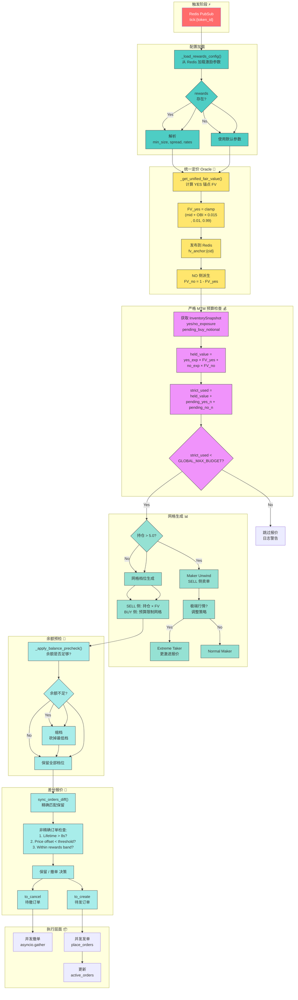

# Tick 处理流程



## 热路径关键指标

```
┌─────────────────────────────────────────────────────────────────────┐
│                        Tick 处理性能目标                            │
├─────────────────────────────────────────────────────────────────────┤
│  🏃 端到端延迟:     < 10ms (无 DB 读取)                             │
│  📊 内存读取:       InventoryStateManager (热路径零 DB)            │
│  🔄 并发发单:       asyncio.gather (所有档位并发)                   │
│  📝 异步持久化:     有界队列 maxsize=1000, 关闭时排空               │
└─────────────────────────────────────────────────────────────────────┘
```

## 差分报价核心逻辑

```python
def sync_orders_diff(self, desired_buckets):
    """
    精确匹配保留，非精确按规则决策
    """
    # 1. 签名当前活跃订单
    active_by_sig = {
        (side, round(price,4), round(size,4)): [orders]
    }

    # 2. 遍历活跃订单
    for order_id, meta in self.active_orders.items():
        sig = _order_signature(meta)

        if sig in desired_buckets:
            # 精确匹配 → 保留
            desired_buckets[sig].pop()
        else:
            # 非精确 → 三重保护检查
            if meta.age_sec < RECONCILIATION_BUFFER:
                continue  # Lifetime 保护
            if price_diff <= PRICE_OFFSET_THRESHOLD:
                continue  # 价格偏移保护
            if within_rewards_band(meta.price):
                continue  # Rewards Band 保护
            to_cancel.append(order_id)

    # 3. 保留的 desired 生成 to_create
    to_create = [o for bucket in desired_buckets for o in bucket]
```

## 三重抗干扰保护

| 保护机制 | 触发条件 | 保护效果 |
|----------|----------|----------|
| **Lifetime 保护** | 订单年龄 < 8s | 成交后短期内不因价格变动而撤单 |
| **价格偏移保护** | 价格变动 < 0.005 | 轻微价格波动不撤单 |
| **Rewards Band 保护** | 订单仍在奖励带内 | 保持激励收益 |

---

*设计亮点: 热路径零 DB，统一定价 Oracle，差分报价最小化交易摩擦*
