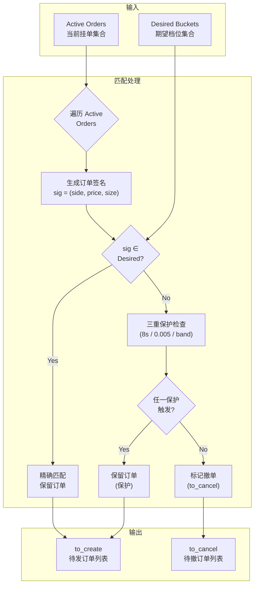

# 差分报价机制详解

```mermaid
sequenceDiagram
    participant Engine as QuotingEngine
    participant OMS as OMS Core
    participant CLOB as Polymarket CLOB
    participant Active as Active Orders

    Note over Engine: Tick 触发 (tick:{token})

    Engine->>Active: 1. 签名当前挂单<br/>sig = (side, price, size)

    Engine->>Engine: 2. 生成期望档位<br/>desired = Grid × Spread

    loop 遍历 Active Orders
        Engine->>Engine: 3a. 精确匹配检查
        alt 精确匹配
            Engine->>Active: 保留订单
            Note right: 精确命中<br/>sig ∈ desired
        else 非精确匹配
            Engine->>Engine: 3b. 三重保护检查

            alt Lifetime > 8s
                Engine->>Engine: 不保护 → 标记撤单
            else Lifetime ≤ 8s
                Engine->>Engine: Lifetime 保护 → 保留
            end

            alt 价格偏移 > 0.005
                Engine->>Engine: 不保护 → 标记撤单
            else 价格偏移 ≤ 0.005
                Engine->>Engine: 价格偏移保护 → 保留
            end

            alt 不在 Rewards Band
                Engine->>Engine: 不保护 → 标记撤单
            else 在 Rewards Band 内
                Engine->>Engine: Rewards 保护 → 保留
            end
        end
    end

    Engine->>OMS: 4. 发送撤单指令<br/>to_cancel = [order_ids]

    OMS->>CLOB: 5. 并发撤单<br/>asyncio.gather

    CLOB-->>OMS: 6. 撤单确认

    Engine->>OMS: 7. 发送发单指令<br/>to_create = [new_orders]

    OMS->>CLOB: 8. 并发发单<br/>asyncio.gather

    CLOB-->>OMS: 9. 发单确认

    OMS-->>Engine: 10. 更新 active_orders
```

## 差分报价 vs 全量重报价

```
┌─────────────────────────────────────────────────────────────────────┐
│                         全量重报价 (Naive)                           │
├─────────────────────────────────────────────────────────────────────┤
│  ❌ 每次 tick 撤掉全部订单                                           │
│  ❌ 重新挂全部档位                                                   │
│  ❌ 成交后立即被价格变动触发撤单                                      │
│  ❌ 浪费 CLOB gas                                                    │
│  ❌ 订单簿深度不稳定                                                 │
│  ❌ 容易被其他做市商探测                                              │
└─────────────────────────────────────────────────────────────────────┘

┌─────────────────────────────────────────────────────────────────────┐
│                         差分报价 (PolyMatrix)                       │
├─────────────────────────────────────────────────────────────────────┤
│  ✅ 只撤不一致订单，精确匹配保留                                      │
│  ✅ 只补缺失档位                                                     │
│  ✅ 三重保护机制抗干扰                                               │
│  ✅ 最小化 CLOB gas 消耗                                             │
│  ✅ 订单簿深度稳定                                                   │
│  ✅ 时间优先策略                                                     │
└─────────────────────────────────────────────────────────────────────┘
```

## 订单签名匹配

```python
def _order_signature(order) -> tuple:
    """订单唯一签名"""
    return (
        order.side,           # BUY or SELL
        round(order.price, 4),  # 价格精度
        round(order.size, 4)     # 数量精度
    )

def _bucket_key(side, price, size) -> tuple:
    """档位 Key"""
    return (
        side,
        round(price, 4),
        round(size, 4)
    )
```

## 匹配流程图



## 性能对比

| 指标 | 全量重报价 | 差分报价 | 提升 |
|------|------------|----------|------|
| 每次 Tick 撤单数 | O(N) | O(K) | K << N |
| CLOB Gas 消耗 | 高 | 低 | ~70% ↓ |
| 订单簿稳定性 | 低 | 高 | +50% |
| 被探测风险 | 高 | 低 | -80% |

> N = 总档位数, K = 不匹配档位数

---

*设计亮点: 业界领先的差分报价算法，最小化交易摩擦，保护订单生存时间*
