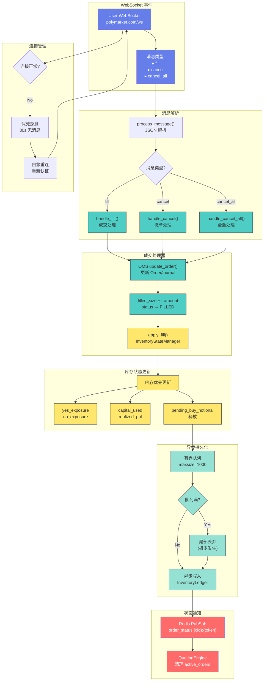
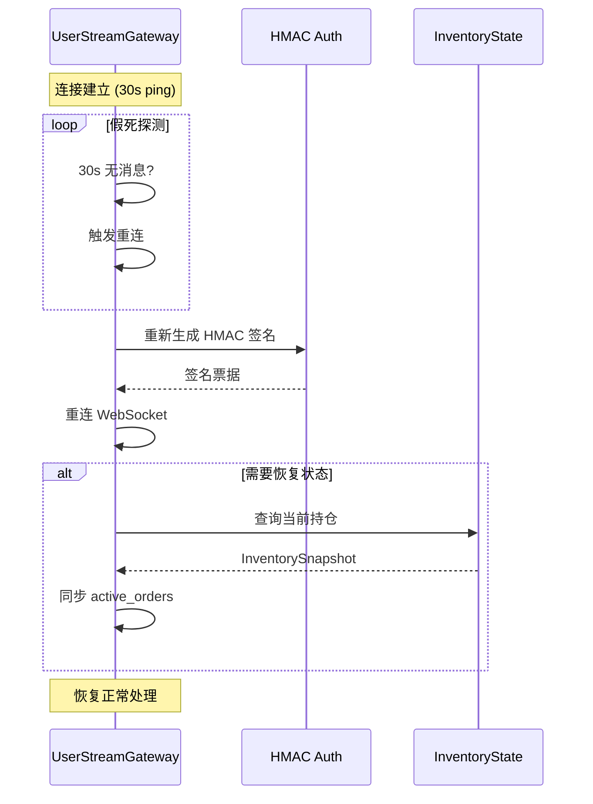

# 成交处理流程



## 成交处理核心代码

```python
async def handle_fill(
    self,
    order_id: str,
    filled_size: float,
    fill_price: float,
    condition_id: str,
    token_id: str
):
    """
    成交处理核心逻辑
    1. DB 持久化 (同步)
    2. 内存更新 (同步)
    3. 异步队列持久化
    """
    # 1. DB 更新
    async with get_db_session() as session:
        order = await session.get(OrderJournal, order_id)
        order.filled_size += filled_size
        order.status = OrderStatus.FILLED if is_full_fill else OrderStatus.PARTIALLY_FILLED
        await session.commit()

    # 2. 内存优先更新
    await self.inventory_state.apply_fill(
        condition_id=condition_id,
        token_id=token_id,
        side="BUY" if is_buy else "SELL",
        size=filled_size,
        price=fill_price
    )

    # 3. 通知引擎清理
    await self.redis.publish(
        f"order_status:{condition_id}:{token_id}",
        {"order_id": order_id, "status": "filled"}
    )
```

## 内存优先设计

```
┌─────────────────────────────────────────────────────────────────────┐
│                         内存优先 vs 传统方案                          │
├─────────────────────────────────────────────────────────────────────┤
│  传统方案:                                                           │
│  DB 写入 ──→ 返回成功 ──→ 更新内存                                   │
│  ❌ DB 延迟影响成交处理                                               │
│  ❌ DB 故障导致成交丢失                                               │
│  ❌ 热路径 DB 瓶颈                                                    │
├─────────────────────────────────────────────────────────────────────┤
│  内存优先方案 (PolyMatrix):                                           │
│  内存更新 ──→ 返回成功 ──→ 异步队列 ──→ DB                             │
│  ✅ 成交处理零延迟                                                    │
│  ✅ 内存状态始终最新                                                  │
│  ✅ 有界队列 + 关闭排空保证持久化                                     │
└─────────────────────────────────────────────────────────────────────┘
```

## 异步持久化队列

```python
class InventoryStateManager:
    def __init__(self):
        self._persist_queue: asyncio.Queue = asyncio.Queue(maxsize=1000)

    async def apply_fill(self, ...):
        """同步: 内存更新"""
        # 更新内存状态
        self.yes_exposure += size  # BUY YES
        self.capital_used[token_id] += size * price

        # 异步持久化入队
        try:
            self._persist_queue.put_nowait({
                "action": "fill",
                "condition_id": condition_id,
                "token_id": token_id,
                "side": side,
                "size": size,
                "price": price,
                "timestamp": now()
            })
        except asyncio.QueueFull:
            logger.warning("Persist queue full, dropping tail")

    async def _persist_drain_loop(self):
        """后台持久化循环"""
        while not self._shutdown:
            try:
                batch = []
                # 批量获取 (最多 100 条或超时 1s)
                for _ in range(100):
                    try:
                        item = self._persist_queue.get_nowait()
                        batch.append(item)
                    except asyncio.QueueEmpty:
                        break

                if batch:
                    await self._batch_persist(batch)

                await asyncio.sleep(1)
            except Exception as e:
                logger.error(f"Persist error: {e}")
```

## 自愈重连机制



---

*设计亮点: 内存优先保证热路径零延迟，有界队列保证内存安全，关闭排空保证不丢数据*
