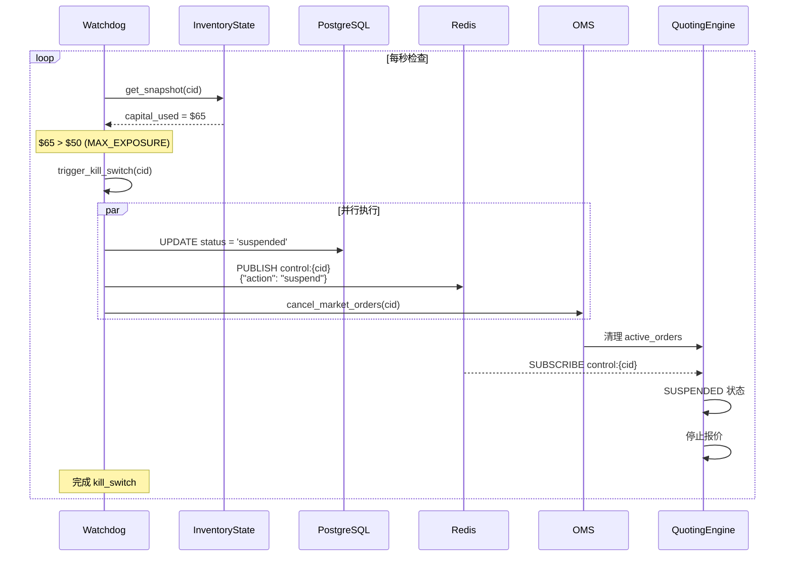

# 多层风控体系

```mermaid
graph TB
    subgraph L1["第一层: 报价前预检 🚦"]
        A1["QuotingEngine<br/>on_tick()"]
        A2["MAX_EXPOSURE_PER_MARKET<br/>单市场敞口红线: $50"]
        A3["GLOBAL_MAX_BUDGET<br/>全局资金红线: $1000"]
        A4["MTM 持仓 + pending BUY<br/>严格口径"]
        A5["余额预检<br/>_apply_balance_precheck()"]
        A1 --> A2 --> A3 --> A4 --> A5
    end

    subgraph L2["第二层: Watchdog 硬熔断 ⚡"]
        B1["RiskMonitor<br/>每秒检查"]
        B2["check_exposure()<br/>capital_used 监控"]
        B3["单市场超限?<br/>→ trigger_kill_switch()"]
        B4["trigger_kill_switch():<br/>1. DB: status → suspended<br/>2. Redis: control:{cid}<br/>3. OMS: cancel_market_orders()"]
        B1 --> B2 --> B3 --> B4
    end

    subgraph L3["第三层: REST 周期对账 🔍"]
        C1["reconciliation_loop()<br/>默认 60s 间隔"]
        C2["GET Polymarket<br/>Data API /positions"]
        C3["对比: DB vs API<br/>yes/no_exposure"]
        C4{"差异 ><br/>EXPOSURE_TOLERANCE?"}
        C5["覆盖更新<br/>InventoryLedger"]
        C6["apply_reconciliation_snapshot()<br/>同步内存状态"]
        C1 --> C2 --> C3 --> C4
        C4 -->|Yes| C5 --> C6
        C4 -->|No| C7["跳过"]
    end

    subgraph L4["第四层: 硬重置强制对账 🔧"]
        D1["每 5 分钟<br/>硬重置周期"]
        D2["cancel_all_for_hard_reset()<br/>全钱包 CLOB cancel_all"]
        D3["睡眠 3s<br/>等待 USDC 释放"]
        D4["本地 cancel_all<br/>force_evict=True"]
        D5["reconcile_single_market<br/>(force=True)"]
        D6{"对账<br/>成功?"}
        D7["POST_RESET_<br/>RECONCILE_FREEZE"]
        D1 --> D2 --> D3 --> D4 --> D5 --> D6
        D6 -->|Yes| D8["正常报价"]
        D6 -->|No| D7
    end

    subgraph Trigger["触发链路"]
        T1["任意层触发"]
        T2["→ 撤单 + suspend"]
        T3["→ 事件通知"]
        T1 --> T2 --> T3
    end

    %% 样式
    classDef l1 fill:#ffe66d,stroke:#333
    classDef l2 fill:#ff6b6b,color:#fff
    classDef l3 fill:#4ecdc4,stroke:#333
    classDef l4 fill:#f093fb,stroke:#333
    classDef trigger fill:#a8edea,stroke:#333

    class A1,A2,A3,A4,A5 l1
    class B1,B2,B3,B4 l2
    class C1,C2,C3,C4,C5,C6,C7 l3
    class D1,D2,D3,D4,D5,D6,D7,D8 l4
    class T1,T2,T3 trigger
```



## 风控参数矩阵

```
┌─────────────────────────────────────────────────────────────────────────────┐
│                            风控参数一览表                                     │
├──────────────────┬────────────────┬─────────────────────────────────────────┤
│      参数        │     默认值      │                 说明                    │
├──────────────────┼────────────────┼─────────────────────────────────────────┤
│ MAX_EXPOSURE_    │    $50         │  单市场敞口红线                          │
│ PER_MARKET       │                │  超过 → kill_switch                      │
├──────────────────┼────────────────┼─────────────────────────────────────────┤
│ GLOBAL_MAX_      │    $1000       │  全局资金红线                            │
│ BUDGET           │                │  仅日志警告，不全局熔断                   │
├──────────────────┼────────────────┼─────────────────────────────────────────┤
│ EXPOSURE_        │    0.01        │  对账覆盖阈值                            │
│ TOLERANCE        │                │  差异 > 1% → 覆盖                        │
├──────────────────┼────────────────┼─────────────────────────────────────────┤
│ RECONCILIATION_  │    8s          │  本地成交后保护窗口                       │
│ BUFFER_SECONDS   │                │  8s 内跳过对账覆盖                       │
├──────────────────┼────────────────┼─────────────────────────────────────────┤
│ RECONCILIATION_  │    60s         │  Watchdog 对账间隔                       │
│ INTERVAL_SEC     │                │                                         │
├──────────────────┼────────────────┼─────────────────────────────────────────┤
│ HARD_RESET_      │    3s          │  硬重置后等待 USDC 释放                  │
│ CLOB_CANCEL_ALL_│                │                                         │
│ SLEEP_SEC        │                │                                         │
├──────────────────┼────────────────┼─────────────────────────────────────────┤
│ EVENT_HORIZON_   │    24h         │  事件地平线窗口                          │
│ HOURS            │                │  结算前 24h → graceful_exit              │
└──────────────────┴────────────────┴─────────────────────────────────────────┘
```

## 熔断链路



## 时间保护机制

```python
def should_skip_reconciliation(local_timestamp: datetime) -> bool:
    """
    本地成交后 N 秒内跳过对账覆盖
    防止: 本地成交但 API 还未更新的窗口期
    """
    elapsed = (now() - local_timestamp).total_seconds()
    return elapsed < RECONCILIATION_BUFFER_SECONDS
```

```
Timeline:
────────────────────────────────────────────────────────────────►
    ↑
  Fill
  事件
    │                    │                    │
    │◄── 8s 保护窗口 ────►│                    │
    │                    │                    │
    └─ 跳过对账覆盖 ──────┘                    │
                                             └─ 恢复对账覆盖
```

---

*设计亮点: 四层风控体系，从报价前预检到硬重置，全方位无死角保护资金安全*
