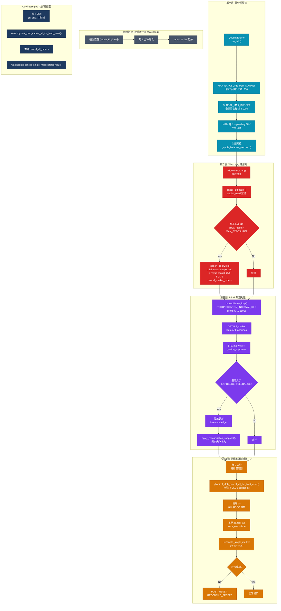
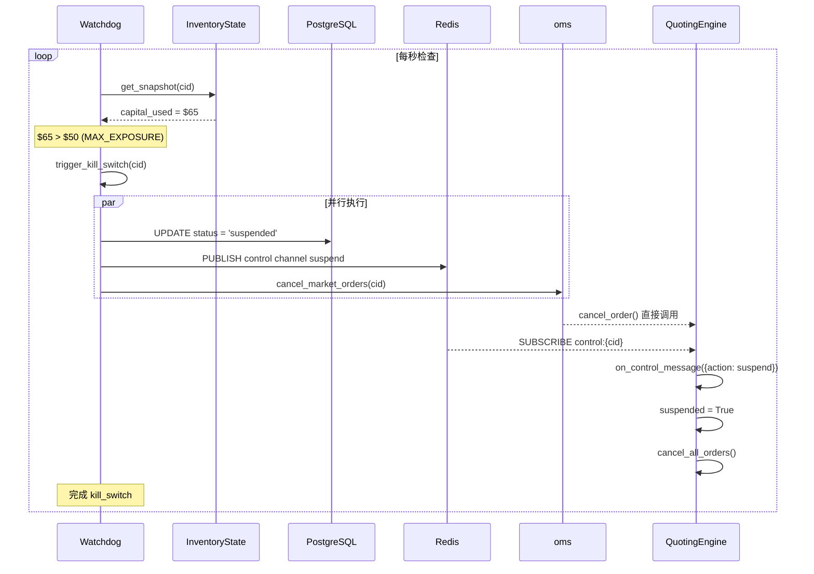
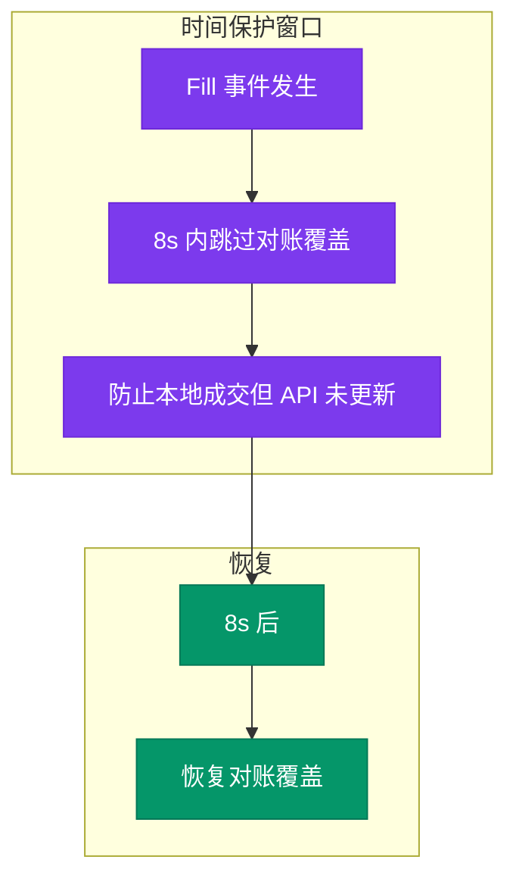

# 多层风控体系



> **图注**：硬重置由 `QuotingEngine.on_tick()` 触发，**不在** Watchdog 内；第四层「硬重置强制对账」描述的是引擎侧流程与 Watchdog `reconcile_single_market(force=True)` 的协作关系。

## 风控参数矩阵

| 参数 | 默认值 | 说明 |
|------|--------|------|
| MAX_EXPOSURE_PER_MARKET | $50 | 单市场敞口红线<br/>超过 → kill_switch |
| GLOBAL_MAX_BUDGET | $1000 | 全局资金红线<br/>仅日志警告，不全局熔断 |
| EXPOSURE_TOLERANCE | 0.01 | 对账覆盖阈值<br/>差异 > 1% → 覆盖 |
| RECONCILIATION_BUFFER_SECONDS | 8s | 本地成交后保护窗口<br/>8s 内跳过对账覆盖 |
| RECONCILIATION_INTERVAL_SEC | 3600s（默认，见 `config.py`） | Watchdog `reconcile_positions` 周期间隔；可由 `.env` 覆盖 |
| HARD_RESET_CLOB_CANCEL_ALL_SLEEP_SEC | 3s | 硬重置后等待 USDC 释放 |
| EVENT_HORIZON_HOURS | 24h | 事件地平线窗口<br/>结算前 24h → graceful_exit |

## 熔断链路



## 时间保护机制

```python
def should_skip_reconciliation(local_timestamp: datetime) -> bool:
    """
    本地成交后 N 秒内跳过对账覆盖
    防止: 本地成交但 API 还未更新的窗口期
    """
    elapsed = (now() - local_timestamp).total_seconds()
    return elapsed < RECONCILIATION_BUFFER_SECONDS
```



---

*设计亮点: 四层风控体系，从报价前预检到硬重置，全方位无死角保护资金安全*
