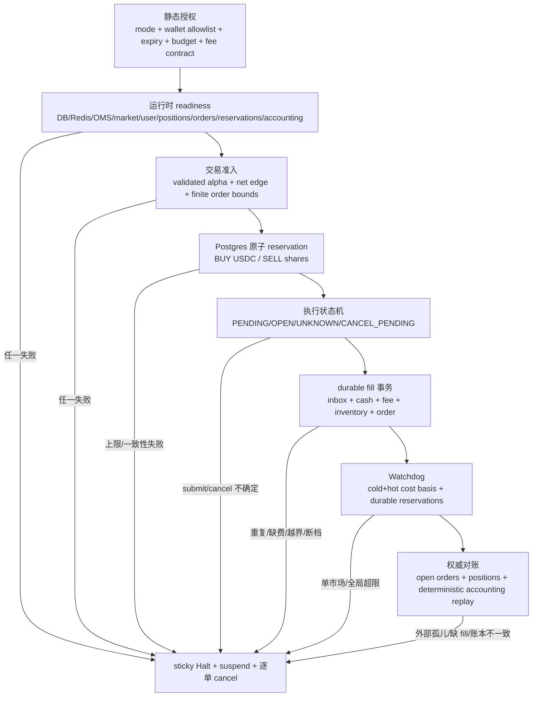

# 当前风险控制层

```mermaid
flowchart TB
    A["静态授权<br/>mode + wallet allowlist + expiry + budget + fee contract"]
    B["运行时 readiness<br/>DB/Redis/OMS/market/user/positions/orders/reservations/accounting"]
    C["交易准入<br/>validated alpha + net edge + finite order bounds"]
    D["Postgres 原子 reservation<br/>BUY USDC / SELL shares"]
    E["执行状态机<br/>PENDING/OPEN/UNKNOWN/CANCEL_PENDING"]
    F["durable fill 事务<br/>inbox + cash + fee + inventory + order"]
    G["Watchdog<br/>cold+hot cost basis + durable reservations"]
    H["权威对账<br/>open orders + positions + deterministic accounting replay"]
    I["sticky Halt + suspend + 逐单 cancel"]

    A --> B --> C --> D --> E --> F
    F --> G --> H
    B -->|"任一失败"| I
    C -->|"任一失败"| I
    D -->|"上限/一致性失败"| I
    E -->|"submit/cancel 不确定"| I
    F -->|"重复/缺费/越界/断档"| I
    G -->|"单市场/全局超限"| I
    H -->|"外部孤儿/缺 fill/账本不一致"| I
```

## 关键不变量

- 新增 BUY 默认关闭；reward 不能让负经济性报价过闸。
- BUY/SELL 在 journal 或网络请求之前分别预占资金/可卖 shares。
- 网络异常后的订单状态是 `UNKNOWN`，reservation 不释放。
- “不在开放订单列表”不等于已撤单；必须查询逐单终态并核对 matched fills。
- 成交、reservation 释放、库存成本、净 PnL、现金事实和订单状态同事务提交。
- 缺失手续费不是 0；会计版本失效、PnL 显示 `N/A`、新增 live 风险停止。
- Data API 仓位差异只能作为风险事实；覆盖后账本标记 `unverified_external`，不能继续当作精确会计。
- 自动退出必须满足可见深度、最大冲击和成本亏损下限；不存在 0.01 dump。
- wallet-wide `cancel_all` Hard Reset 和本地 `force_evict` 已彻底删除。

## 主要默认值

| 配置 | 默认 | 安全作用 |
|---|---:|---|
| `TRADING_MODE` | `disabled` | 不启动交易网络服务。 |
| `OFFLINE_VALIDATED_ALPHA_ENABLED` | `False` | 关闭新增 BUY。 |
| `LIVE_FEE_ACCOUNTING_VALIDATED` | `False` | 未验证手续费契约时禁止 live。 |
| `GLOBAL_MAX_BUDGET` | `1000` | 组合 cost basis + BUY reservations 上限。 |
| `MAX_EXPOSURE_PER_MARKET` | `40` | 单市场 cost basis + BUY reservations 上限。 |
| `MARKET_DATA_MAX_AGE_SEC` | `5` | 陈旧盘口撤单/暂停。 |
| `RECONCILIATION_INTERVAL_SEC` | `300` | 周期仓位事实比较；差异 fail closed。 |
| `EXIT_MAX_BOOK_IMPACT` | `0.02` | 自动 SELL 最大可见盘口冲击。 |
