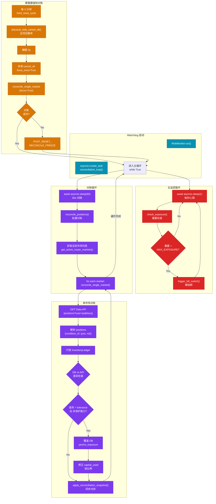
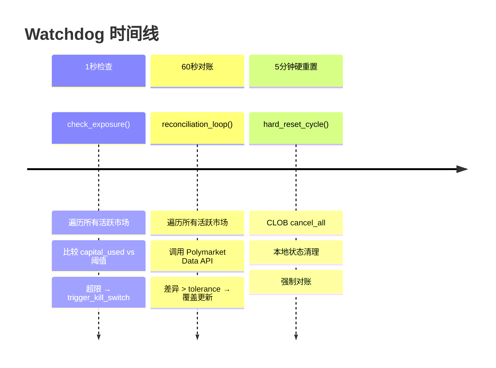
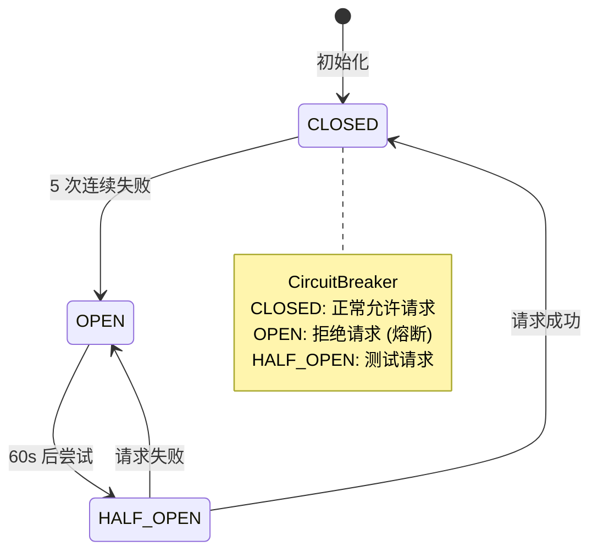

# Watchdog 监控机制



## check_exposure 核心逻辑

```python
async def check_exposure(self):
    """
    每秒检查所有活跃市场的暴露
    触发 kill_switch 条件:
    - 单市场 capital_used > MAX_EXPOSURE_PER_MARKET
    """
    active_cids = get_active_router_markets()

    for cid in active_cids:
        # 获取内存快照 (热路径零 DB)
        snap = await inventory_state.get_snapshot(cid)

        # 计算实际使用资金
        actual_used = snap.yes_capital_used + snap.no_capital_used

        if actual_used > MAX_EXPOSURE_PER_MARKET:
            # DB 验证状态
            async with get_db_session() as session:
                market = await session.get(MarketMeta, cid)
                if market.status != MarketStatus.SUSPENDED:
                    await self.trigger_kill_switch(cid, session)
```

## 对账核心逻辑

```python
async def reconcile_single_market(self, condition_id: str, force: bool = False):
    """
    单市场对账:
    1. 从 Polymarket Data API 获取真实持仓
    2. 对比本地 DB 记录
    3. 差异超过容差 → 覆盖更新
    """
    # 1. 获取 API 持仓
    api_positions = await self._fetch_api_positions(address)

    # 2. 获取本地 DB 持仓
    async with get_db_session() as session:
        async with session.begin():
            ledger = await session.get(
                InventoryLedger,
                (condition_id, funding_address),
                with_for_update=True  # 行锁
            )

            # 3. 对比差异
            diff_yes = abs(api_positions.yes - ledger.yes_exposure)
            diff_no = abs(api_positions.no - ledger.no_exposure)

            if max(diff_yes, diff_no) > EXPOSURE_TOLERANCE:
                # 4. 时间保护
                if not force and self._within_reconciliation_buffer(ledger):
                    return True  # 跳过

                # 5. 覆盖更新
                ledger.yes_exposure = api_positions.yes
                ledger.no_exposure = api_positions.no

                # 6. 修正 capital_used
                ratio = api_positions.yes / max(ledger.yes_exposure, 0.001)
                ledger.yes_capital_used *= ratio

    # 6. 同步内存
    await inventory_state.apply_reconciliation_snapshot(condition_id, ledger)
    return True
```

## 监控时间线



## 熔断器状态



---

*设计亮点: 多时间尺度的风控检查，从秒级熔断到分钟级对账，全方位保障系统安全*
