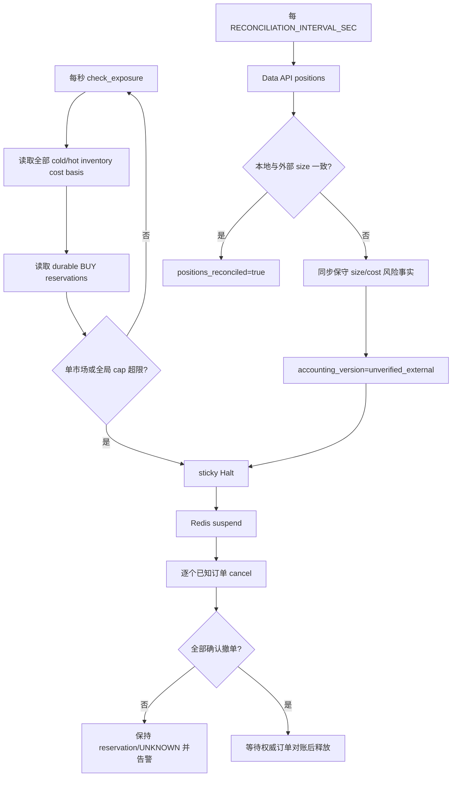

# Watchdog 当前机制

Watchdog 只承担风险监测、仓位事实比较与 Kill Switch；它不修复缺失成交，也不执行 wallet-wide Hard Reset。

```mermaid
flowchart TB
    A["每秒 check_exposure"] --> B["读取全部 cold/hot inventory cost basis"]
    B --> C["读取 durable BUY reservations"]
    C --> D{"单市场或全局 cap 超限?"}
    D -->|"否"| A
    D -->|"是"| E["sticky Halt"]
    E --> F["Redis suspend"]
    F --> G["逐个已知订单 cancel"]
    G --> H{"全部确认撤单?"}
    H -->|"否"| I["保持 reservation/UNKNOWN 并告警"]
    H -->|"是"| J["等待权威订单对账后释放"]

    K["每 RECONCILIATION_INTERVAL_SEC"] --> L["Data API positions"]
    L --> M{"本地与外部 size 一致?"}
    M -->|"是"| N["positions_reconciled=true"]
    M -->|"否"| O["同步保守 size/cost 风险事实"]
    O --> P["accounting_version=unverified_external"]
    P --> E
```

## 仓位对账语义

- Data API 只能证明当前仓位数量，不能证明成交顺序、手续费、成本或已实现 PnL。
- 本地成交后的短时间保护窗避免延迟 REST 立即覆盖刚提交的 fill。
- 保护窗结束后发现差异时，可以把外部数量用于保守风险控制，但必须使精确会计失效并 Halt。
- 外部存在、本地完全没有 ledger 的仓位同样阻止 readiness。
- User WS 重连会触发全量比较；它不能替代认证 trade-history 回填。

## 与其他对账的边界

- 开放订单：由 `app/oms/order_reconciliation.py` 使用 `get_orders` + `get_order` 权威处理。
- 成交与会计：由 `fill_events`、`fill_cash_ledger` 和确定性 accounting replay 处理。
- Watchdog 不会根据仓位差额制造虚构 fill，也不会把估算成本重新标成 `v2`。
