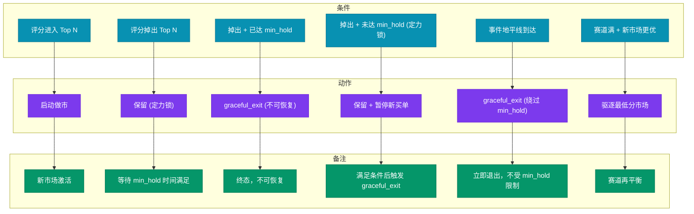
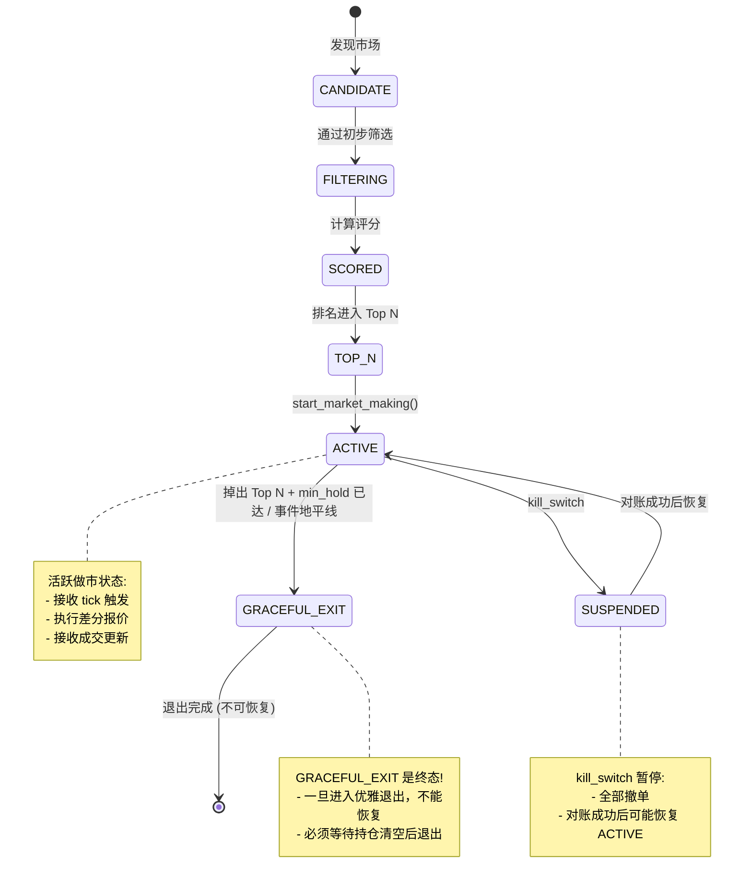

# 自动路由与组合管理

```mermaid
%%{init: {'theme': 'base', 'themeVariables': {
  'primaryColor': '#1e3a5f',
  'primaryTextColor': '#ffffff',
  'primaryBorderColor': '#334155',
  'lineColor': '#64748b'
}}%%
flowchart TB
    subgraph Trigger["触发机制（auto_router.run）"]
        A["sleep<br/>AUTO_ROUTER_SCAN_INTERVAL_SEC<br/>默认 3600s；启动后先立即扫"]
        B["CLOB rewards/markets/multi<br/>分页 + Gamma 补 endDate/tags"]
    end

    subgraph Filter["过滤阶段"]
        C{"rewards<br/>存在?"}
        D{"奖励与规模过滤<br/>见 _radar_scan 代码"}
        E{"非体育<br/>非黑名单?"}
        F{"距结算是否大于<br/>EVENT_HORIZON_HOURS?"}
        G["候选市场<br/>Passed Filters"]
        C -->|Yes| D
        C -->|No| DROP1["丢弃"]
        D -->|Yes| E
        D -->|No| DROP2["丢弃"]
        E -->|Yes| F
        E -->|No| DROP3["丢弃"]
        F -->|Yes| G
        F -->|No| DROP4["丢弃: 已结算"]
    end

    subgraph Score["评分阶段 _radar_scan"]
        H["每市场: rate(日池) r_min comp<br/>→ daily_roi = rate/r_min<br/>→ penalty = max(1, log1p(comp))"]
        L["score = rate × daily_roi / penalty<br/>分页聚齐后排序 → 短名单<br/>→ Gamma 批量补 endDate/tags"]
    end

    subgraph Select["选择阶段"]
        M{"Top N?<br/>评分排名"}
        N{"赛道限额<br/>MAX_SLOTS<br/>MAX_EXPOSURE?"}
        O["市场列表<br/>Selected Markets"]
    end

    subgraph Rebalance["重平衡阶段"]
        P{"市场已活跃?"}
        Q{"掉出 Top N?"}
        R{"满足<br/>min_hold_hours?"}
        S["graceful_exit<br/>优雅退出"]
        T["启动<br/>新市场"]
    end

    subgraph Execute["执行阶段"]
        U["MarketLifecycle<br/>start_market_making"]
        V["QuotingEngine<br/>× 2 (YES/NO)"]
        W["Redis PubSub<br/>tick:, control:"]
    end

    %% 连接
    A --> B
    B --> C
    C --> D
    D --> E
    E --> F
    F --> G
    G --> H
    H --> L
    L --> M
    M -->|Yes| N
    M -->|No| Q
    N -->|Yes| O
    N -->|No| DROP5["丢弃: 赛道满"]
    O --> P
    P -->|No| T
    P -->|Yes| Q
    Q -->|Yes| R
    Q -->|No| U
    R -->|Yes| S
    R -->|No| DROP6["保留: min_hold"]
    S --> U
    T --> U
    U --> V
    V --> W

    classDef filter fill:#0891b2,stroke:#0e7490,color:#fff
    classDef score fill:#7c3aed,stroke:#6d28d9,color:#fff
    classDef select fill:#475569,stroke:#334155,color:#fff
    classDef exec fill:#dc2626,stroke:#b91c1c,color:#fff

    class C,D,E,F,G filter
    class H,L score
    class M,N,O select
    class U,V,W exec
```



## 评分算法（与 `auto_router._radar_scan` 一致）

```python
# 摘自逻辑：对每个通过黑名单与门槛的 rewards 市场
rate = _parse_rewards_rate_from_rewards_api(m)       # 日奖励池 USD/天
r_min = _parse_rewards_min_size_from_rewards_api(m)  # 最小挂单规模
comp = _parse_competitiveness(m)

daily_roi = rate / r_min if r_min > 0 else 0.0
competition_penalty = max(1.0, math.log1p(max(comp, 0.0)))
score = (rate * daily_roi) / competition_penalty

# 全量分页收集后再 sort(key=score)，取短名单；再用 Gamma 批量补 endDate/tags，
# 经事件视界过滤后得到最终 Top N（见 _radar_scan 尾部）。
```

## 赛道隔离规则

| 参数 | 说明 | 示例 |
|------|------|------|
| MAX_SLOTS_PER_SECTOR | 单标签最多 N 个市场 | sports:nba ≤ 3 |
| MAX_EXPOSURE_PER_SECTOR | 单标签最大敞口 | sports ≤ $300 |
| SECTOR_TAG_BLACKLIST | 黑名单标签 | sports:esports |

## 重平衡决策表



## 生命周期状态流转



---

*设计亮点: 智能化组合管理，赛道隔离保护，多维度评分算法，最大化做市收益*
