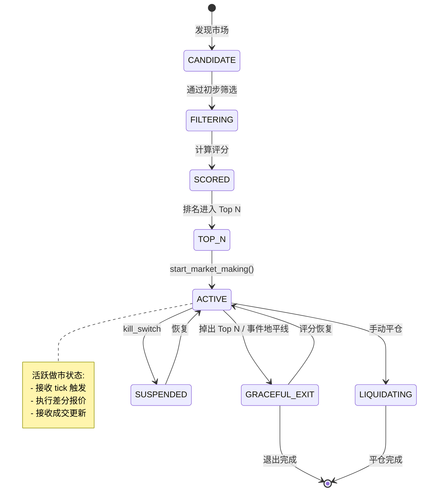

# 自动路由与组合管理

```mermaid
flowchart TB
    subgraph Trigger["触发机制 ⏰"]
        A["定时扫描<br/>默认 5 分钟"]
        B["Gamma API<br/>批量查询"]
    end

    subgraph Filter["过滤阶段 🎯"]
        C{"rewards<br/>存在?"}
        D{"流动性<br/>≥ $20,000?"}
        E{"非体育<br/>非黑名单?"}
        F{"事件地平线<br/>> 24h?"}
        G["候选市场<br/>Passed Filters"]
        C -->|Yes| D
        C -->|No| DROP1["丢弃"]
        D -->|Yes| E
        D -->|No| DROP2["丢弃"]
        E -->|Yes| F
        E -->|No| DROP3["丢弃"]
        F -->|Yes| G
        F -->|No| DROP4["丢弃: 已结算"]
    end

    subgraph Score["评分阶段 🏆"]
        H["daily_roi<br/>日收益"]
        I["rate<br/>年化利率"]
        J["liquidity<br/>流动性评分"]
        K["time_decay<br/>时间衰减"]
        L["总分 =<br/>ROI × rate ×<br/>(10000/liquidity)<br/>× time_decay"]
    end

    subgraph Select["选择阶段 🎯"]
        M{"Top N?<br/>评分排名"}
        N{"赛道限额<br/>MAX_SLOTS<br/>MAX_EXPOSURE?"}
        O["市场列表<br/>Selected Markets"]
    end

    subgraph Rebalance["重平衡阶段 ⚖️"]
        P{"市场已活跃?"}
        Q{"掉出 Top N?"}
        R{"满足<br/>min_hold_hours?"}
        S["graceful_exit<br/>优雅退出"]
        T["启动<br/>新市场"]
    end

    subgraph Execute["执行阶段 🚀"]
        U["MarketLifecycle<br/>start_market_making"]
        V["QuotingEngine<br/>× 2 (YES/NO)"]
        W["Redis PubSub<br/>tick:, control:"]
    end

    %% 连接
    A --> B
    B --> C
    C --> D
    D --> E
    E --> F
    F --> G
    G --> H
    H --> I
    I --> J
    J --> K
    K --> L
    L --> M
    M -->|Yes| N
    M -->|No| Q
    N -->|Yes| O
    N -->|No| DROP5["丢弃: 赛道满"]
    O --> P
    P -->|No| T
    P -->|Yes| Q
    Q -->|Yes| R
    Q -->|No| U
    R -->|Yes| S
    R -->|No| DROP6["保留: min_hold"]
    S --> U
    T --> U
    U --> V
    V --> W

    classDef filter fill:#ffe66d,stroke:#333
    classDef score fill:#4ecdc4,stroke:#333
    classDef select fill:#95e1d3,stroke:#333
    classDef exec fill:#ff6b6b,color:#fff

    class C,D,E,F,G filter
    class H,I,J,K,L score
    class M,N,O select
    class U,V,W exec
```



## 评分算法

```python
def score_market(
    market: MarketInfo,
    current_time: datetime
) -> float:
    """
    组合评分公式:
    Score = daily_roi × rate × (10000 / liquidity) × time_decay

    - daily_roi: 日收益潜力 (年化 / 365)
    - rate: 年化利率 (激励收益)
    - (10000/liquidity): 流动性稀缺性因子
    - time_decay: 时间衰减 (越接近结算越低)
    """
    daily_roi = market.rewards.annual_roi / 365
    rate = market.rewards.rate
    liquidity_factor = 10000 / max(market.liquidity, 1)

    hours_to_event = (market.end_date - current_time).total_seconds() / 3600
    time_decay = clamp(hours_to_event / 24, 0.1, 1.0)  # 最小 0.1

    return daily_roi * rate * liquidity_factor * time_decay
```

## 赛道隔离规则

```
┌─────────────────────────────────────────────────────────────────────────────┐
│                              赛道隔离参数                                    │
├─────────────────────────────────────────────────────────────────────────────┤
│                                                                             │
│  MAX_SLOTS_PER_SECTOR          │  单标签最多 N 个市场                        │
│  例: "sports:nba" ≤ 3          │                                           │
│                                 │                                           │
│  MAX_EXPOSURE_PER_SECTOR       │  单标签最大敞口                            │
│  例: "sports" ≤ $300           │                                           │
│                                 │                                           │
│  SECTOR_TAG_BLACKLIST          │  黑名单标签                                │
│  例: ["sports:esports"]        │  排除特定领域                              │
│                                                                             │
└─────────────────────────────────────────────────────────────────────────────┘
```

## 重平衡决策

```mermaid
decision_table
    ┌─────────────────────┬─────────────────────┬─────────────────────┐
    │       条件          │       动作          │        备注         │
    ├─────────────────────┼─────────────────────┼─────────────────────┤
    │ 评分进入 Top N      │ 启动做市            │ 新市场激活          │
    ├─────────────────────┼─────────────────────┼─────────────────────┤
    │ 评分掉出 Top N      │ 检查 min_hold       │ 需满足持有时间      │
    ├─────────────────────┼─────────────────────┼─────────────────────┤
    │ 掉出 + 已达 min_hold│ graceful_exit       │ 优雅退出            │
    ├─────────────────────┼─────────────────────┼─────────────────────┤
    │ 掉出 + 未达 min_hold│ 保留 + 暂停新买单   │ 等待满足条件        │
    ├─────────────────────┼─────────────────────┼─────────────────────┤
    │ 事件地平线到达      │ graceful_exit       │ 绕过 min_hold       │
    ├─────────────────────┼─────────────────────┼─────────────────────┤
    │ 赛道满 + 新市场更优  │ 驱逐最低分市场      │ 赛道再平衡          │
    └─────────────────────┴─────────────────────┴─────────────────────┘
```

## 生命周期状态流转



---

*设计亮点: 智能化组合管理，赛道隔离保护，多维度评分算法，最大化做市收益*
