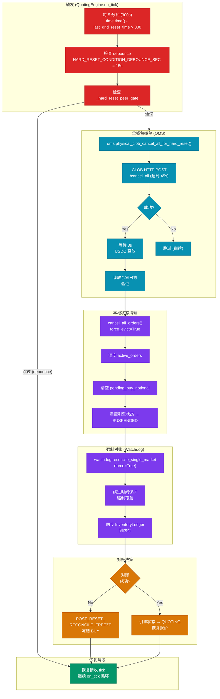
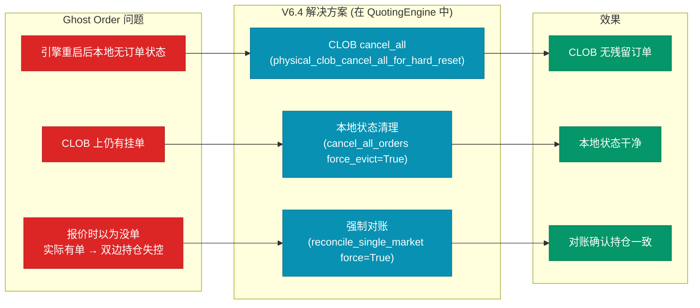
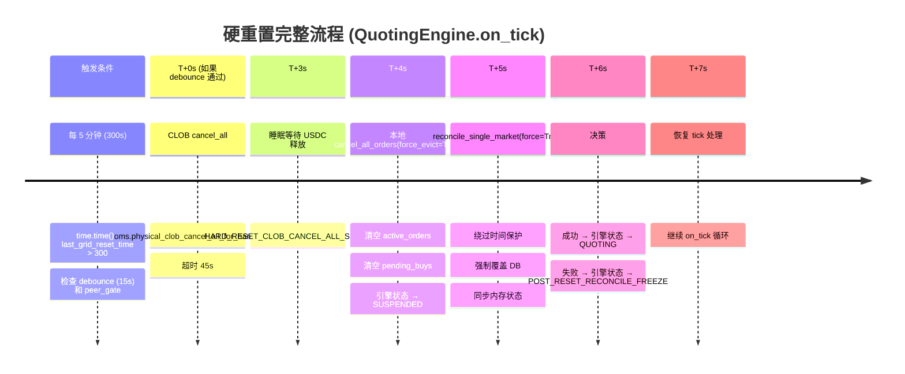

# 硬重置流程 (V6.4)

> **注意**: 硬重置逻辑在 QuotingEngine.on_tick() 中触发，不是一个独立的调度任务。



## 硬重置核心代码

```python
async def physical_clob_cancel_all_for_hard_reset(self):
    """
    V6.4 硬重置:
    1. 全钱包 CLOB cancel_all (超时 45s)
    2. 等待 USDC 释放 (默认 3s)
    3. 读取余额日志
    4. 清理本地状态
    """
    # 1. CLOB 全钱包撤单
    try:
        result = await self.clob_client.cancel_all(
            timeout=45,
            retries=1
        )
        logger.info(f"Cancel all result: {result}")
    except asyncio.TimeoutError:
        logger.error("CLOB cancel_all timeout")
        raise

    # 2. 等待 USDC 释放
    await asyncio.sleep(HARD_RESET_CLOB_CANCEL_ALL_SLEEP_SEC)

    # 3. 验证余额变化
    balance_log = await self._read_balance_log()
    logger.info(f"Balance after cancel_all: {balance_log}")

    # 4. 清理本地状态
    await self.cancel_all_orders(force_evict=True)

    # 5. 强制对账
    for cid in get_active_router_markets():
        success = await reconcile_single_market(cid, force=True)
        if not success:
            logger.warning(f"Reconcile failed for {cid}, will freeze")
            set_engine_state(cid, EngineState.POST_RESET_RECONCILE_FREEZE)


async def cancel_all_orders(self, force_evict: bool = False):
    """
    强制清理所有本地订单状态
    force_evict: True 时强制从 active_orders 移除
    """
    async with self._orders_lock:
        # 并发撤单
        cancel_tasks = [
            self.cancel_order(oid)
            for oid in list(self.active_orders.keys())
        ]
        await asyncio.gather(*cancel_tasks, return_exceptions=True)

        # 强制驱逐
        if force_evict:
            self.active_orders.clear()
            self._pending_buys.clear()

        # 重置状态
        self._state = EngineState.SUSPENDED
```

## Ghost Order 防护



## 重置时间线 (在 QuotingEngine.on_tick 中)



## 对账失败冻结

```python
# 对账失败后的状态
if not reconcile_success:
    engine_state = EngineState.POST_RESET_RECONCILE_FREEZE

    # 效果:
    # - 禁止新 BUY 订单
    # - 保持现有持仓
    # - 每分钟重试对账
    # - 下次对账成功 → 恢复正常
```

---

*设计亮点: V6.4 硬重置彻底解决 Ghost Order 问题，5 分钟周期保证系统状态最终一致*
