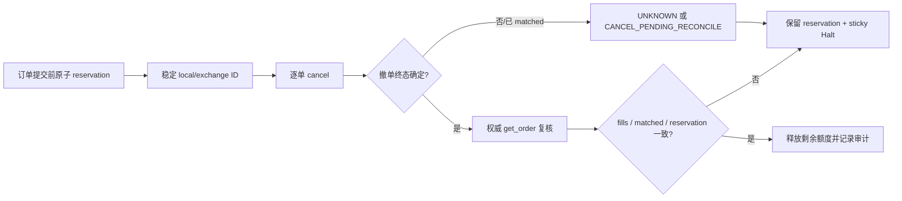

# Wallet-wide Hard Reset（已删除）

> 状态：REMOVED。本文保留这个文件名，是为了让旧文档链接明确落到“已删除”结论，而不是 404 或继续传播旧架构。

原 V6.4 流程会定时执行全钱包 `cancel_all`，随后无论逐单撤单是否成功都可能 `force_evict` 本地活动订单，再用仓位 REST 覆盖本地库存。该流程会同时制造三类无法证明安全的状态：

- 交易所订单仍开放，但本地已遗忘；
- 撤单与成交并发，reservation 被错误释放或成交未入账；
- 远端仓位数量覆盖本地后，成本、手续费和 realized PnL 被伪装成可信。

当前代码已经删除：

- `QuotingEngine.on_tick()` 的 5 分钟 Hard Reset 分支；
- `cancel_all_orders(force_evict=True)`；
- `physical_clob_cancel_all_for_hard_reset()` 及 wallet-wide `cancel_all` fallback；
- 全部 `PERIODIC_HARD_RESET_*` / `HARD_RESET_CLOB_*` 配置入口；
- Hard Reset 后“只冻结一个 tick”再继续 BUY 的状态。

替代链路如下：

```mermaid
flowchart LR
    A["订单提交前原子 reservation"] --> B["稳定 local/exchange ID"]
    B --> C["逐单 cancel"]
    C --> D{"撤单终态确定?"}
    D -->|"否/已 matched"| E["UNKNOWN 或 CANCEL_PENDING_RECONCILE"]
    D -->|"是"| F["权威 get_order 复核"]
    E --> G["保留 reservation + sticky Halt"]
    F --> H{"fills / matched / reservation 一致?"}
    H -->|"否"| G
    H -->|"是"| I["释放剩余额度并记录审计"]
```

任何“清理幽灵订单”的需求都必须通过开放订单权威对账解决，不能重新引入定时全钱包清空或本地强制遗忘。
