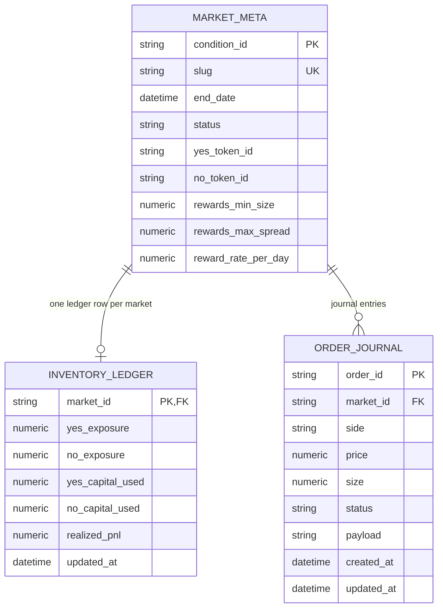
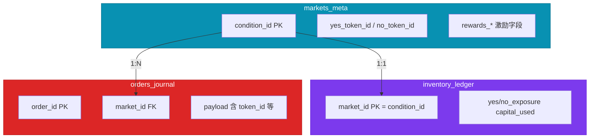
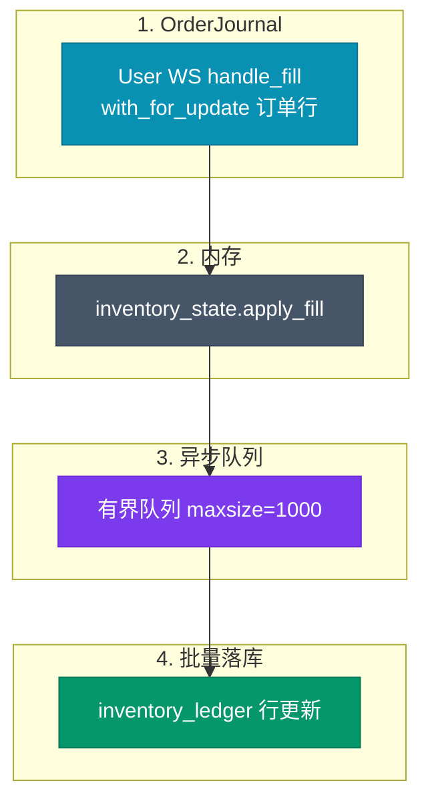

# 数据库实体关系图（与 `app/models/db_models.py` 一致）

当前 ORM **仅包含三张业务表**：`markets_meta`、`orders_journal`、`inventory_ledger`。激励字段挂在 **`MarketMeta`** 上，**无**独立的 `rewards_config` 表；**无** `funding_address` 表（资金地址来自配置 `FUNDER_ADDRESS`）。



## 表关系说明（flowchart）



## 说明

- **`InventoryLedger` 主键**仅为 `market_id`（对应 `condition_id`），不按钱包地址分表。
- **成交与库存**：User WS `handle_fill` 更新 `OrderJournal` 与内存 `inventory_state`，再异步刷写 `inventory_ledger`；与下图示意的 SQL 仅为概念参考，**以 ORM 字段为准**。

## 库存计算口径（概念 SQL，非必须与实际列名一一对应）

```sql
-- 示例：按市场 join 元数据做 MTM（定价来自引擎/Redis，非本表持久化）
SELECT
    il.market_id,
    il.yes_exposure,
    il.no_exposure,
    il.yes_capital_used + il.no_capital_used AS total_capital_used
FROM inventory_ledger il
JOIN markets_meta mm ON il.market_id = mm.condition_id;
```

## 索引设计（建议）

```sql
CREATE INDEX IF NOT EXISTS idx_orders_journal_market_id ON orders_journal(market_id);
CREATE INDEX IF NOT EXISTS idx_orders_journal_status ON orders_journal(status);
CREATE INDEX IF NOT EXISTS idx_orders_journal_created_at ON orders_journal(created_at DESC);
CREATE INDEX IF NOT EXISTS idx_markets_meta_status ON markets_meta(status);
```

## 异步持久化队列（InventoryStateManager）

内存单例 + **有界队列**异步写入 `inventory_ledger`，与 `app/core/inventory_state.py` 一致；热路径 `on_tick` **不读**该表。



---

*与实现文件对齐：`app/models/db_models.py`、`app/core/inventory_state.py`。*
