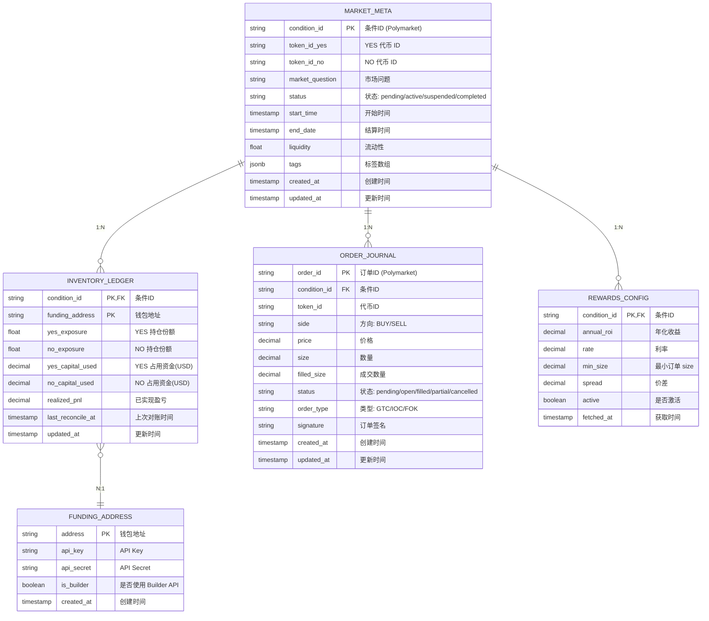
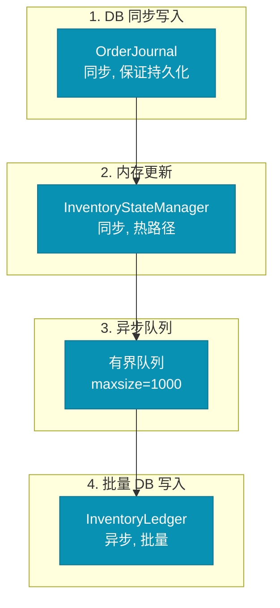

# 数据库实体关系图



## 表关系说明

```mermaid
%%{init: {'theme': 'base', 'themeVariables': {
  'primaryColor': '#1e3a5f',
  'primaryTextColor': '#ffffff',
  'primaryBorderColor': '#334155',
  'lineColor': '#64748b'
}}%%
flowchart TB
    subgraph MARKET_META["MARKET_META (市场元数据)"]
        M1["condition_id (PK)"]
        M2["token_id_yes / token_id_no"]
        M3["status / end_date"]
    end

    subgraph INVENTORY_LEDGER["INVENTORY_LEDGER (库存台账)"]
        I1["condition_id (PK,FK)"]
        I2["funding_address (PK)"]
        I3["yes/no_exposure"]
        I4["yes/no_capital_used"]
    end

    subgraph ORDER_JOURNAL["ORDER_JOURNAL (订单日志)"]
        O1["order_id (PK)"]
        O2["condition_id (FK)"]
        O3["side / price / size"]
        O4["filled_size / status"]
    end

    subgraph REWARDS_CONFIG["REWARDS_CONFIG (激励配置)"]
        R1["condition_id (PK,FK)"]
        R2["annual_roi / rate"]
    end

    subgraph FUNDING_ADDRESS["FUNDING_ADDRESS (钱包)"]
        F1["address (PK)"]
        F2["api_key / api_secret"]
    end

    MARKET_META -->|"1:N"| INVENTORY_LEDGER
    MARKET_META -->|"1:N"| ORDER_JOURNAL
    MARKET_META -->|"1:N"| REWARDS_CONFIG
    INVENTORY_LEDGER -->|"N:1"| FUNDING_ADDRESS

    classDef market fill:#0891b2,stroke:#0e7490,color:#fff
    classDef ledger fill:#7c3aed,stroke:#6d28d9,color:#fff
    classDef order fill:#dc2626,stroke:#b91c1c,color:#fff
    classDef rewards fill:#d97706,stroke:#b45309,color:#fff
    classDef funding fill:#059669,stroke:#047857,color:#fff

    class MARKET_META,market
    class INVENTORY_LEDGER,ledger
    class ORDER_JOURNAL,order
    class REWARDS_CONFIG,rewards
    class FUNDING_ADDRESS,funding
```

## 库存计算口径

```sql
-- 实时库存计算
SELECT
    il.condition_id,
    il.funding_address,
    il.yes_exposure,
    il.no_exposure,
    il.yes_capital_used + il.no_capital_used AS total_capital_used,
    -- MTM 盯市价值
    il.yes_exposure * mm.current_fv_yes +
    il.no_exposure * mm.current_fv_no AS mtm_value,
    -- 未实现盈亏
    il.yes_exposure * (mm.current_fv_yes - mm.entry_price_yes) +
    il.no_exposure * (mm.current_fv_no - mm.entry_price_no) AS unrealized_pnl
FROM inventory_ledger il
JOIN market_meta mm ON il.condition_id = mm.condition_id
WHERE il.funding_address = :address;
```

## 索引设计

```sql
-- 核心查询索引
CREATE INDEX idx_order_journal_condition_id ON order_journal(condition_id);
CREATE INDEX idx_order_journal_status ON order_journal(status);
CREATE INDEX idx_order_journal_created_at ON order_journal(created_at DESC);
CREATE INDEX idx_inventory_ledger_address ON inventory_ledger(funding_address);
CREATE INDEX idx_market_meta_status ON market_meta(status);
CREATE INDEX idx_market_meta_end_date ON market_meta(end_date);
```

## 异步持久化队列

```python
# InventoryStateManager 有界队列
class InventoryStateManager:
    _persist_queue: asyncio.Queue = asyncio.Queue(maxsize=1000)

    async def apply_fill(self, ...):
        # 1. 内存更新 (同步, 零延迟)
        self.yes_exposure += size
        self.capital_used += size * price

        # 2. 异步持久化 (不阻塞热路径)
        try:
            self._persist_queue.put_nowait({
                "action": "fill",
                "condition_id": condition_id,
                "size": size,
                "price": price,
                "timestamp": now()
            })
        except asyncio.QueueFull:
            logger.warning("Persist queue full")

    async def _persist_drain_loop(self):
        """后台持久化循环 (批次写入)"""
        while not self._shutdown:
            batch = []
            for _ in range(100):
                try:
                    item = self._persist_queue.get_nowait()
                    batch.append(item)
                except asyncio.QueueEmpty:
                    break

            if batch:
                await self._batch_persist(batch)

            await asyncio.sleep(1)
```

## 状态同步流程



---

*设计亮点: 内存优先 + 异步批量持久化，热路径零 DB，保证高性能同时不丢数据*
