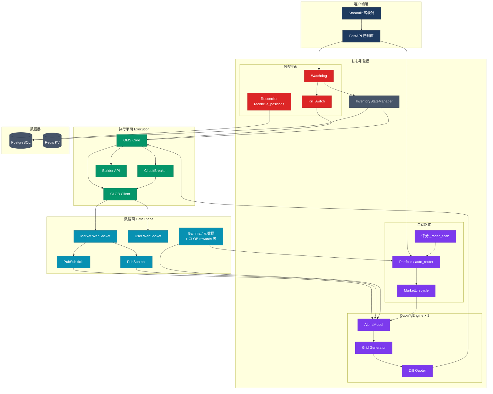

# 组件关系总览（Mermaid）

> 对应原 PlantUML 架构总览图，**单一工具链**：与本目录其他图一致，用 Mermaid 在 GitHub / VS Code 即可渲染。  
> **做市行为与标志位**见 [`03_quoting_state_machine.md`](./03_quoting_state_machine.md)；**四层风控细节**见 [`07_risk_control_layers.md`](./07_risk_control_layers.md)。

## 图注

- **Redis**：`tick:` / `ob:` / `control:` / `order_status:` 等同实例上的 Pub/Sub 主题，图中只画与引擎订阅主链相关的 tick/ob。
- **Scorer**：逻辑在 `auto_router._radar_scan` 内，与 `PortfolioMgr` 为同一模块内的步骤，虚线表示「从属」而非跨进程调用。
- **Reconciler**：周期由 `RECONCILIATION_INTERVAL_SEC` 控制（默认 3600s），与硬重置后的 `reconcile_single_market(force=True)` 不同，详见 [`08_watchdog_mechanism.md`](./08_watchdog_mechanism.md)。

---

*原 `12/13/14_plantuml_*.puml` 已移除，统一维护 Mermaid 源。*
