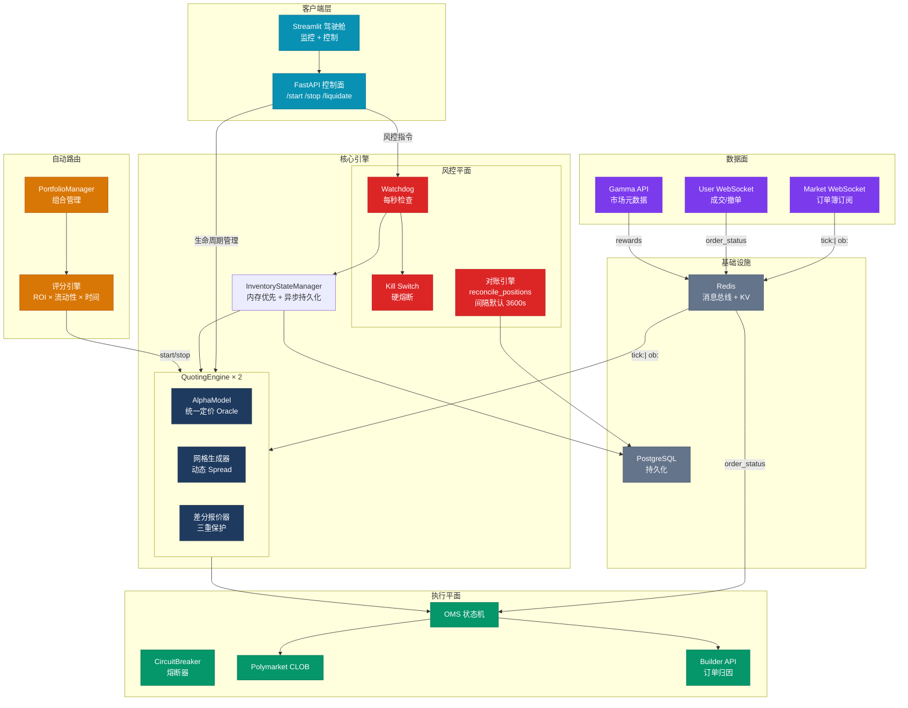
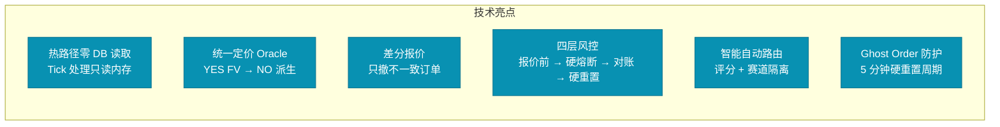

# PolyMatrix Engine V6.4 系统概览

## 核心设计亮点

## 核心参数一览

| 参数 | 值 | 说明 |
|------|-----|------|
| MAX_EXPOSURE_PER_MARKET | $50 | 单市场敞口上限 |
| GLOBAL_MAX_BUDGET | $1000 | 全局资金上限 |
| EXPOSURE_TOLERANCE | 1% | 对账容差 |
| RECONCILIATION_BUFFER | 8s | 时间保护窗口 |
| RECONCILIATION_INTERVAL_SEC | 3600s（默认） | Watchdog 全量对账；`.env` 可改 |
| HARD_RESET_INTERVAL | 5min | 硬重置间隔 |
| EVENT_HORIZON | 24h | 事件地平线 |
| CIRCUIT_BREAKER_FAILURES | 5次 | 熔断阈值 |

## 快速导航

| 图表 | 文件 | 内容 |
|------|------|------|
| 系统架构 | `01_system_overview.md` | 整体架构图 |
| 模块关系 | `02_module_relationships.md` | 核心模块关系 |
| 状态机 | `03_quoting_state_machine.md` | QuotingEngine 状态机 |
| Tick 处理 | `04_tick_processing_flow.md` | Tick 处理流程 |
| 差分报价 | `05_differential_quoting.md` | 差分报价详解 |
| 成交处理 | `06_fill_processing_flow.md` | 成交处理流程 |
| 风控体系 | `07_risk_control_layers.md` | 多层风控体系 |
| Watchdog | `08_watchdog_mechanism.md` | Watchdog 监控机制 |
| 自动路由 | `09_auto_router.md` | 自动路由与组合管理 |
| 硬重置 | `10_hard_reset_flow.md` | 硬重置流程 |
| 数据库 | `11_database_erd.md` | 数据库 ER 图 |

---

*PolyMatrix Engine V6.4 - 面向 Polymarket 的准机构级自动化做市与流动性引擎*
