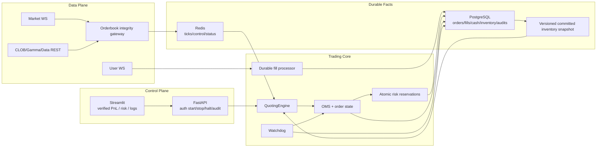

# PolyMatrix Engine 当前架构总览

> 实盘结论：**NO-GO**。当前代码已经建立 fail-closed 工程边界，但真实数据契约、历史成交/账本恢复和策略盈利统计仍未完成。

## 运行平面

## 核心边界

### 安全授权

- 默认 `TRADING_MODE=disabled`，不启动交易网络服务。
- live 需要 wallet allowlist、24h 内 arm、预算 ceiling、费用 adapter 契约确认和全部 runtime readiness。
- `OFFLINE_VALIDATED_ALPHA_ENABLED` 不是充分条件；必须由内置评估器生成 hash 固定的 `alpha-evidence-v2`，并与策略 ID、运行参数、关键源码哈希及构建 commit 完全匹配。
- 奖励排名 Auto-Router 永久限制为 paper-only；reward 元数据不能改变 size、spread、旧单保留或报价准入。
- Dashboard 奖励/流动性榜单仅作研究观测，不再宣称收益/安全，也不能从榜单直接启动策略。
- live 启动还会校验所有运行策略参数的有限性和安全范围；非法订单量、网格、点差、缓冲、退出或限额配置直接拒绝。
- 管理写接口需要至少 32 字符 Bearer Token；wipe 还要求 disabled、无引擎、无未决订单、无非零仓位、显式开关和精确确认头。

### 订单与风险

- BUY 在提交前用 Postgres wallet singleton 行锁预占 USDC；SELL 预占可卖 shares。
- local order primary key 永不被 exchange ID 替换。
- 提交/撤单结果不确定时进入 `UNKNOWN`/`CANCEL_PENDING_RECONCILE`，reservation 不释放。
- 交易 SDK/凭据只在本地审计和静态 arm 通过后延迟加载；模块导入不会接触交易所。
- 撤旧单未确认时禁止创建替代单；引擎异常、stop、halt 和进程 shutdown 都先尝试确认撤单，失败即 sticky Halt。
- 开放订单权威对账使用 `get_orders` + 逐单 `get_order`；只有 matched/local fills/reservation/identity 全部一致才关闭并释放。
- wallet-wide Hard Reset、force-evict 和 0.01 liquidation 已删除。

### 成交与会计

- 确定性 fill event ID 保证重放幂等。
- fill、reservation、cash、fee、inventory、order 与 inbox 状态同事务提交。
- 明确 BUY fee 资本化、SELL fee 费用化；缺失 fee 保持 `UNKNOWN`，不会当 0。
- 每个 fill 绑定 `accounting_state_version`；启动/管理端从零重放 v2 fills 并核对 exposure/cost/net realized PnL。
- REST 仓位数量差异会把账本降级为 `unverified_external`；Risk API/Dashboard 只在最新 audit `SAFE` 时显示 PnL。

### 行情与报价

- 盘口校验有限数、价格/数量、双边流动性、cross/lock、exchange time、snapshot hash/可选 sequence 和 freshness；当前无 sequence 契约依靠 hash + 周期 REST 重同步。
- 无效/陈旧/gap 行情会发布 invalid tick，撤已知订单并暂停报价。
- 新 BUY 默认关闭；开启后还要通过 risk reservation 和 reward-independent net-edge gate。
- 自动 SELL 只使用损失下限与最大价格冲击范围内的可见深度。
- Watchdog 是 live 必须 readiness；监控循环异常、单市场/全局越线或 Kill 撤单不完整都会 sticky Halt。

## 数据模型

当前迁移 head 为 `009`。核心表：

- `orders_journal`
- `fill_events`
- `fill_cash_ledger`
- `inventory_ledger`
- `risk_reservations`
- `portfolio_risk_state`
- `order_reconciliation_runs` / `exchange_order_snapshots`
- `accounting_audit_runs`

详见 [`architecture_diagrams/11_database_erd.md`](./architecture_diagrams/11_database_erd.md)。

## 仍然阻塞实盘

- User WS/CLOB/fee payload 的真实契约确认（当前按要求不做在线验证）。
- `MISSING_FILLS` 的认证 trade-history 回填与无 exchange ID 的人工恢复。
- 历史 v1 账本需要完整 fills/fees 后才可离线重建，不能猜测。
- 行情 checksum、YES/NO 互补校验与故障注入回放。
- 尚未提供可复现的真实离线数据集，因此内置评估器还无法生成一份合格证据；当前示例报告故意无效。
- 当前 OBI-mid 策略尚未通过扣除费用/奖励后的样本外统计门槛。
